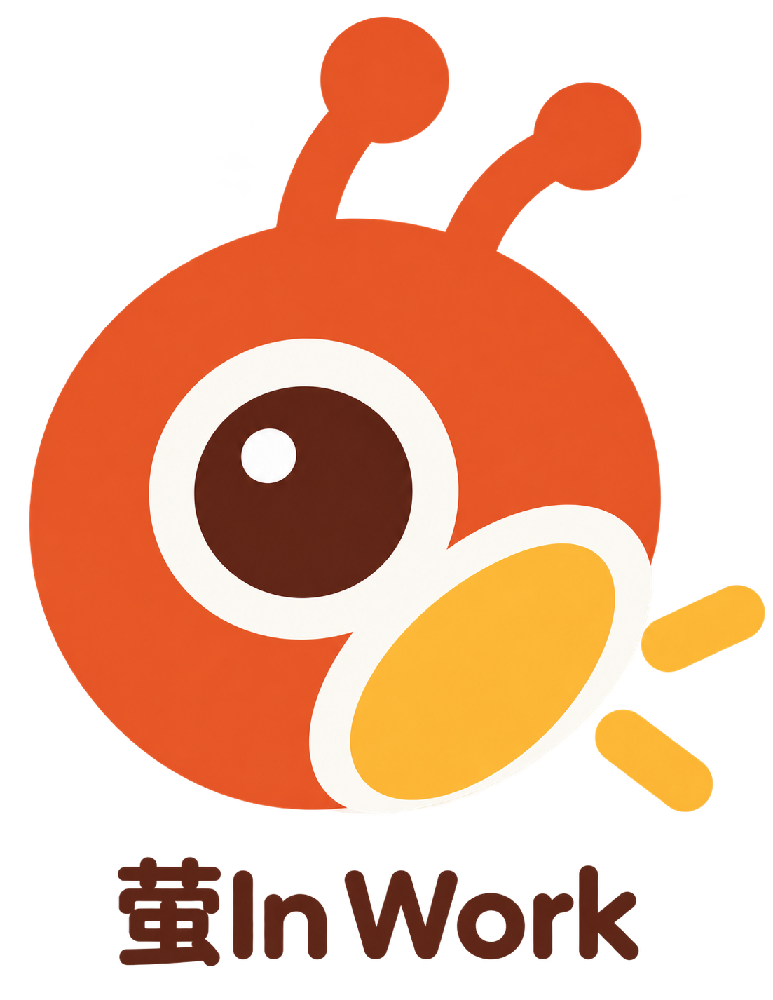

<p align="center">
  
</p>

# 萤 In Work

**你的工作情绪搭子。** 面向 Windows 的桌面陪伴软件，将摄像头预览、状态观察、互动放松、专注计时和桌面悬浮窗整合在一个应用中。

由 **光沐煦合** 团队构建，当前版本 **1.3.1**。

> 当前版本已删除软件主动转动寻人的功能，仅保留 Link 2 原生人像追踪。此前原生追踪的实机效果尚未验收通过，不能将本版本视为该硬件问题已修复。

## 功能

| 功能 | 说明 |
| --- | --- |
| 工位视窗 | 各页面共享摄像头预览，可放大查看；优先使用 Insta360 Link 2 |
| 本机摄像头兼容 | 未连接或无法打开 Link 2 时尝试本机摄像头，停用云台相关功能 |
| 原生人像追踪 | 调用 Link 2 原生追踪；无人时等待，不发送软件主动扫视指令 |
| 状态观察 | 眼周、舌象、皮肤和可见表情观察，带全屏倒计时及实时画面 |
| 自动表情观察 | 用户配置并允许云端分析后，按约 10 秒周期抽帧；请求未返回时不叠加发送 |
| 本地陪伴提醒 | 基于本地人脸在场检测的久坐、用眼休息提醒 |
| 互动放松 | 眼部米字操、颈部十字操、呼吸引导；Link 2 可参与云台联动 |
| 摄像头猜拳 | 本地 MediaPipe 识别手势，支持石头剪刀布对战 |
| 专注与记录 | 专注计时、历史记录和 JSON 导出 |
| 桌面小萤 | 全局悬浮、拖动、靠边隐藏；左键双击打开主界面，右键打开功能菜单 |
| 语音指令 | 使用 Windows 本地中文语音识别执行固定指令 |

卡路里功能仅预留入口，尚未实现。图像观察用于日常状态参考，不提供医学诊断；在场检测也不等同于姿态或视线测量。

## 直接使用 Windows 版

1. 在本仓库的 **Releases** 中下载 `YingInWork-v1.3.1-windows-x64.zip`。
2. 解压后运行 `萤InWork.exe`，无需安装 Python。
3. 确认系统已安装 **Microsoft Edge WebView2 Runtime**，且摄像头可正常使用。
4. 点击“开始陪伴”查看画面；需要释放摄像头时点击“暂停陪伴”。

软件默认开启陪伴和桌面悬浮窗，可在“偏好设置”中调整。普通摄像头可以使用预览、状态观察、猜拳和屏幕运动引导；原生追踪及云台联动需要 Link 2。

## 配置 Qwen

在“偏好设置”的 AI 配置区填写自己的 API 地址、支持图像输入的模型 ID 和 API Key，保存后测试连接。**文字连接测试成功不代表该模型一定支持图像分析。**

只有启用“允许将采集图像发送到配置的 Qwen 服务”后，才会执行云端图像观察。开启自动表情观察后会持续抽帧调用，产生对应服务的 API 消耗。

开发时也可使用 `QWEN_API_KEY`（或 `DASHSCOPE_API_KEY`）、`QWEN_BASE_URL`、`QWEN_MODEL` 环境变量；环境变量优先于界面保存的配置。模型名称和服务地址以你实际开通的服务为准。本仓库不提供共享密钥。

## 从源码运行

推荐环境：**Windows 10/11 x64、Python 3.12、WebView2 Runtime**。下面的命令均在仓库根目录的 PowerShell 中执行。

### 1. 安装 Python 依赖

```powershell
python -m venv .venv
.\.venv\Scripts\python.exe -m pip install -r product/requirements.txt
```

### 2. 准备运行组件

为了保持源码仓库轻量，FFmpeg、Insta360 SDK 和原生桥接器的二进制文件不提交到 Git。

从同版本 Release 下载 `runtime-windows-x64.zip`，然后运行：

```powershell
.\.venv\Scripts\python.exe tools/setup_runtime.py --archive "$HOME\Downloads\runtime-windows-x64.zip"
.\.venv\Scripts\python.exe tools/setup_runtime.py --check
```

脚本会逐个校验 SHA256，将以下文件放入 `product/native/`：

```text
ffmpeg.exe
UVCCamera.dll
UVCCameraTest.exe
link_camera_bridge.exe
```

本地人脸和手势模型已随源码提供。仅使用本机普通摄像头时，原生运行组件并非所有功能的必需条件；生成完整 EXE 时需准备上述四个文件。

### 3. 启动应用

```powershell
.\.venv\Scripts\python.exe product/main.py
```

需要隔离开发数据时：

```powershell
.\.venv\Scripts\python.exe product/main.py --data-dir tmp/dev
```

## 测试与打包

```powershell
# 自动测试，不需要真实 API Key 或摄像头
.\.venv\Scripts\python.exe -m unittest discover -s product/tests -p "test_*.py" -v

# 桌面与悬浮窗启动检查，不会自动打开摄像头
.\.venv\Scripts\python.exe product/main.py --smoke-test --data-dir tmp/smoke

# 生成单文件 EXE
.\.venv\Scripts\python.exe product/build.py
```

输出：`output/萤InWork-1.3.1/萤InWork.exe`。构建工具使用 PyInstaller，生成的 EXE 不包含个人配置、密钥和数据库。

当前交付已通过 **38 项自动回归测试**以及 EXE 启动检查，并确认打包代码中不再包含主动寻人逻辑。原生追踪的实际转动及持续居中效果仍待设备验收；自动测试通过不代表硬件验收完成。

如需重编译 C++ 桥接器，安装 Visual Studio C++ 构建工具、CMake 和官方 Windows x64 Link SDK，再执行：

```powershell
cmake -S product/native -B build/native -A x64 -DLINK_SDK_DIR="C:/path/to/Link-SDK/UVCCamera_win/x64"
cmake --build build/native --config Release
Copy-Item build/native/Release/link_camera_bridge.exe product/native/
Copy-Item build/native/Release/UVCCamera.dll product/native/
```

`LINK_SDK_DIR` 是示例路径，需替换为本机 SDK 路径。重编译桥接器不是直接使用 Release 或运行已准备好组件的源码所必需的步骤。

## 项目结构

```text
.
├── README.md                    # 项目介绍与运行说明
├── CHANGELOG.md                 # 版本记录
├── THIRD_PARTY_NOTICES.md        # 第三方组件说明
├── docs/                       # 发布说明与 GitHub 上传指南
├── licenses/                   # 随组件保留的许可证、来源说明
├── tools/
│   ├── setup_runtime.py         # 运行组件准备与校验
│   └── runtime-manifest.json    # 对应 1.3.1 的组件哈希
└── product/
    ├── main.py                  # Windows 桌面、托盘与应用生命周期
    ├── service.py               # 陪伴、提醒、活动与记录
    ├── server.py                # 仅本机访问的 API
    ├── camera_service.py        # 摄像头优先级、取流和降级
    ├── portrait_tracking.py     # Link 2 原生追踪状态管理
    ├── gesture_game.py          # 摄像头手势对战
    ├── floating_companion.py    # 全局悬浮窗
    ├── backend/                # Qwen 适配、配置加密与数据库
    ├── frontend/               # 本地 HTML/CSS/JavaScript 界面
    ├── assets/                 # 本地模型与图标
    ├── native/                 # C++ 桥接器源码与运行组件位置
    └── tests/                  # 自动测试
```

## 数据与隐私

- 默认数据目录：`%LOCALAPPDATA%\YingInWork`；使用 `--data-dir` 可指定独立目录。
- API Key 使用当前 Windows 用户的 DPAPI 加密保存，不写入源码或打包 EXE。
- 摄像头预览、在场检测和手势识别在本机处理；应用默认不保存原始视频或照片。
- 云端图像观察需要用户配置并允许，抽帧会发送到所配置的模型服务。
- 本地分析记录和偏好分别保存在数据库、配置文件中，可通过应用管理。
- 本地服务器仅监听 `127.0.0.1`，API 使用每次运行生成的令牌和来源检查。

`.gitignore` 已排除密钥配置、数据库、日志、虚拟环境、运行组件和构建产物。上传时使用整理后的源码目录，勿上传自己的数据目录。

## 常见问题

**没有摄像头画面**：检查 Windows 摄像头权限、USB 连接和其他占用摄像头的应用；连接设备后暂停再开启陪伴。

**云台不跟随**：先确认预览来自 Link 2、原生追踪开关已开启。普通摄像头不支持云台控制。当前版本已移除软件主动寻人；原生追踪的设备兼容问题仍在待验收范围内。

**源码运行提示组件缺失**：执行 `tools/setup_runtime.py --check`，并从同版本 Release 准备运行组件。不要混用其他版本的组件包。

**语音指令无法启动**：检查 Windows 中文语音识别组件和麦克风配置；实际识别效果取决于系统与环境。

**上传 GitHub 时文件过大**：源码提交到 Code；EXE、运行组件 ZIP 上传到 Releases。详细步骤见 [GitHub 上传指南](docs/GITHUB_UPLOAD.md)。

## 项目与组件许可

本次整理未替团队选择开源许可证，项目整体许可由团队确定。第三方组件保留各自的许可与来源说明，见 [THIRD_PARTY_NOTICES.md](THIRD_PARTY_NOTICES.md) 和 `licenses/`。

参考：[Insta360 Link SDK](https://github.com/Insta360Develop/Link-SDK)、[OpenCV YuNet](https://github.com/opencv/opencv_zoo/tree/main/models/face_detection_yunet)、[MediaPipe 手势识别](https://ai.google.dev/edge/mediapipe/solutions/vision/gesture_recognizer)。
